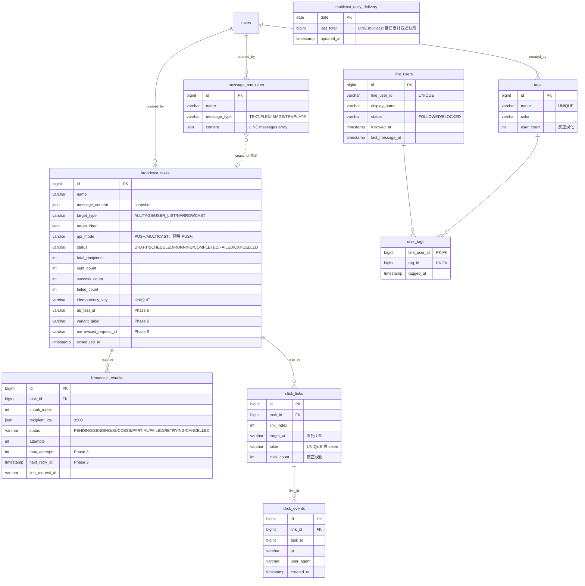

# 架構與工程筆記

本文件是 [`README.md`](../README.md) 的延伸，收錄資料模型、設計權衡、commit 歷史、本機開發流程與已知限制等較深入的內容。對技術細節有興趣的訪客請從這裡入手。

---

## 一、資料模型

### 1.1 ER 圖



### 1.2 規模設計考量

| 表 | 預期量 | 主要索引 | 設計考量 |
|----|--------|----------|---------|
| `line_users` | 數十至百萬 | `status`, `followed_at` | 反正規化 `last_message_at` 避免 JOIN；keyword 搜尋 LIKE 同時涵蓋 `display_name` / `line_user_id` |
| `broadcast_chunks` | 任務數 × 2000（百萬/500） | `(task_id, status)`, `(status, attempts)` | 失敗 chunk 快速重撈 |
| `click_events` | 可高頻 INSERT | `(task_id, created_at)` | 時間區間查詢 |
| `click_links` | 任務數 × 平均 URL 數 | `(task_id, link_index)`, `token UNIQUE` | `click_count` 反正規化避免 COUNT(*) |
| `multicast_daily_delivery` | 每天 1 筆 | `date PK` | 快取 LINE 當日 multicast 累計送達；dashboard widget 用，5 分鐘 TTL |

---

## 二、設計權衡與取捨

每個技術選擇都伴隨成本。下表記錄關鍵抉擇與其背後考量，供 review 時討論：

| 議題 | 選擇 | 理由 |
|------|------|------|
| 訊息佇列 | Redis Stream（不引入 Kafka / RabbitMQ） | 既有 Redis 基礎；本專案規模 Stream 足夠 |
| 限速器 | 手寫 Redis Lua（不用 Bucket4j） | 原子性 + 單一 round-trip |
| 進度推播 | SSE（不用 WebSocket） | 單向 push 即可；瀏覽器自動重連；穿透反向代理不需特殊處理 |
| 計數位置 | Redis 累計 + 定期 flush DB | 避免 task 表 hot row；精度差 ≤ 5 秒可接受 |
| A/B 切分 | 借 USER_LIST 模型（不新增表） | 重用既有派發流程；切分邏輯純粹後端記憶體 shuffle |
| 排程 | `@Scheduled` poller（不用 Quartz） | 用既有 `scheduled_at` 欄位 + 30 秒掃描即可，零新依賴 |
| Click 改寫時機 | submit 前（不在 create） | DRAFT 可被編輯；submit 才 lock message snapshot |
| Flex 編輯器 | JSON + 即時預覽（不做拖拉式） | ROI 偏低；LINE 官方 Flex Simulator 已能補足視覺編輯需求 |
| Push / Multicast 模式 | 同任務模型 + `api_mode` 分流（不分兩種 entity） | Push 拿 per-user 結果、Multicast 省配額；資料模型共用、UI 依模式分流呈現 |
| 4xx 偵測 | 用 SDK 例外型別 + status code（不用字串比對） | 早期用字串比對抓不到 LINE SDK 實際 message format，造成 4xx 被誤判為可重試、最終讓用戶收到重複訊息；改型別判斷一勞永逸 |
| Multicast 成效呈現 | 不做 per-task 送達歸因，改 dashboard 顯示當日累計（DB 表 + 5 分鐘 TTL） | LINE 對 multicast 不提供 per-user 結果、當日累計也隔天才 ready，無法精準歸因到單一任務；任務頁簡化為單行狀態，引導去看 dashboard |
| retry key 設計 | 含 chunk.createdAt + attempts + userId | LINE 的 retry key 有 24 小時去重，chunk_id 一旦被重用（清資料、還原備份）就可能撞到自己上次的 key。把 createdAt 也納入 seed 即可避開，同 chunk 重試仍冪等 |
| Click 改寫的可組合性 | rewriter 遇到自家 token 先反查回原始 URL 再重新包 | submit 時會把 URL 改寫成 tracking link 並寫回 messageContent，使用者複製舊推播當模板時，拿到的就是已經包過一層的版本，不反查就會被重覆包裝 |
| Rate limit defaults | 取 LINE 真實上限的 25% buffer（push 500/sec、multicast 50 batch/sec）| LINE 官方上限 push 2000 req/sec、multicast 200 batches/sec（per channel、不分方案）。預設值留 75% margin 避免 429，但 1M 用戶推播仍可在 33 分鐘內跑完。Plan 升級或 traffic pattern 確認後可透過 yml 上調 |
| Push chunk size | rate-aware 浮動（chunk = pushRate × 2 秒、夾 [50, 5000]）| 寫死 500 在 rate 5/sec 時 worker 鎖 100 秒、rate 500/sec 時又顯得多餘。動態跟著 rate 走、worker 鎖時間恆定 ~2 秒；DB row 與 Stream entry 數量也隨 rate 倒數調整、不會 rate 拉高 chunk 爆量 |
| click_count 寫入 | Redis INCR + dirty set + 排程 5 秒 flush DB | 30 萬點/小時同 link = 30 萬次 UPDATE +1 撞同 row、InnoDB 行鎖排隊 25 分鐘。改 Redis 累積、Lua 原子 GET+SET=0 取 delta、批次寫回；UI 讀取補 Redis delta 不漏算。寫頻率降 400 倍 |
| Stream 長度上限 | 排程每 10 分鐘 approximate XTRIM 到 ~100K | ACK 過的 entry 不會自動消失。長期跑下 Stream 無限長、PEL 掃描與重啟 load 變慢。trim 同放在 DeadLetterScheduler（都是 Stream 健康度維護）|

---

## 三、Commit 結構

對應 [`README.md`](../README.md) §六的 Phase 0–12，每個階段都對應獨立 commit、可逐步用 `git log` 追蹤實作演進。

```
# Phase 0：專案地基與 LINE 串接
feat: 專案初始化（Spring Boot + Redis + JPA + 雙資料庫 + JWT）
feat: LINE Messaging API 串接設定（後端 + 前端 + 串接文件）
chore: 本機開發環境設定 + 一鍵啟動腳本
feat: LINE SDK 啟動時優先從 DB 讀取 Channel Secret 與 Access Token
fix: 修正驗證連線端點在 Spring MVC 環境下回傳 401 的問題

# Phase 1–7：推播功能本體
feat: 推播功能 Phase 1 — LINE 用戶資料與標籤管理
feat: 推播功能 Phase 2 — 模板與簡單推播主流程
feat: 推播功能 Phase 3 — 高併發核心（Redis Stream + Worker Pool + Token Bucket）
feat: 推播功能 Phase 4 — SSE 即時進度、成效統計、失敗清單、PEL dead-letter
feat: 推播功能 Phase 5 — Flex Message 預覽、預設模板庫、匯入/匯出
feat: 推播功能 Phase 6 — 排程、權限細分、Narrowcast、A/B 測試
feat: 推播功能 Phase 7 — Click Tracking、CTR、A/B 用點擊率比較
test: 補上推播功能 Phase 1-7 核心 service 單元測試（最小可信）
fix: 修正 Phase 6 @EnableScheduling 引入第 3 個 Executor bean 導致注入失敗
fix: 修正 LINE 用戶查詢 LazyInit 例外與 Redis Stream worker timeout 洗 log

# Phase 8：AI 串接整合
feat: AI 設定後台化（DB 為主、env fallback）+ 主開關 + AIService doOnError 順序修正

# Phase 9：Push / Multicast 雙模式
fix: 修正推播 submit() 在 transaction commit 前推 Redis Stream 的 race condition
feat: 推播加入 push 模式（apiMode 選擇）
fix: 推播 push 模式 4xx 偵測改用 SDK exception 型別
feat: 推播加上 multicast 日送達增量統計
feat: multicast 結算加 admin 手動觸發 endpoint + 提升可觀測性
refactor: 撤回 multicast per-task delta，改成 daily total query
feat: 推播成效統計依 apiMode 分流（push 用 per-user、multicast 隱藏）

# Phase 10：推播 UX 優化
feat: 推播 USER_LIST 整合 + UI 中文化 + 後端 enum 註解補完
feat: dashboard multicast widget 改查昨日 + 手動重新整理按鈕
feat: 推播詳情批次清單合併（篩選 + 分頁），移除舊失敗清單
feat: 推播詳情頁補「查看 A/B 比較」入口
feat: Flex 預設模板換主題明確的圖
feat: 新增 Flex Simulator JSON 匯入助手

# Phase 11：加好友歡迎訊息
feat: 加入好友歡迎訊息（greeting）後台可編輯 + 程式自動 push
fix: 歡迎訊息 retry key 改用隨機 UUID

# Phase 12：穩定性與可靠度修補
fix: 修點擊追蹤 click_count 不增加的雙層 bug
fix: Dashboard 近 7 天趨勢圖空白 + QA 命中率多乘 100 的 bug
fix: QA cache 與 transaction commit 的 race + 整合測試污染 Redis
fix: 推播錯誤分布改按失敗人數計算 + 圖表視覺調整
fix: 修正 broadcast retry key 在 409 與 chunk_id 重用下的行為
fix: ClickLinkRewriter 對自家 tracking URL 沒 unwrap 導致 double-wrap

# Phase 13：效能與可靠度強化
feat: Stream 加排程 trim 避免無限長
refactor: rate limit default 拉高到 LINE 上限的 25% buffer
feat: PUSH 模式 chunk size 改為 rate-aware 浮動
feat: click_count 改 Redis 累計 + 排程批次回寫 DB 避免 hot row
feat: 點擊統計讀取補上 Redis 未 flush 增量
```

**註記**：`feat: 推播加上 multicast 日送達增量統計` 後被 refactor 撤回，commit 仍保留作為「設計被打回」的演進紀錄，理由見 §二 表格相關列。

---

## 四、已知限制與未實作項目

誠實揭露目前邊界，避免訪客誤解專案完成度：

- **拖拉式 Flex 視覺編輯器**：採用 JSON + 即時預覽，視覺拖拉以 LINE 官方 Flex Simulator 替代，並提供「從 Simulator 貼上」的匯入助手自動包成 messages 陣列。
- **LIFF 整合**：點擊後解析 LINE userId 需要另一套 LIFF 整合，本專案未實作。
- **管理員帳號 CRUD UI**：目前帳號管理只能直接改 DB，5 角色 enum 已支援、後端 API 已完備，缺前端頁面。
- **跨分頁選擇**：LineUsers 表格跨分頁勾選目前只能帶當前頁的選擇進建立推播頁；要做完整跨頁需要批次 by-id 查 API（未實作）。

---

## 五、本機開發（30 分鐘上手）

```bash
# 1. 起 DB + Redis
docker-compose up -d redis mysql

# 2. 設定 .env
cp .env.example .env  # 填入 LINE channel info（或先用 dummy 跑）

# 3. 後端
cd backend && mvn spring-boot:run

# 4. 前端
cd frontend && npm install && npm run dev

# 5. 跑單元測試
cd backend && mvn test
```

預設管理員帳號：`admin / admin123`

更完整的 API 規格、Docker 配置、雲端佈署細節請見 [`README.md`](../README.md)。

---

## 六、截圖檔案清單

`docs/img/` 內容對照（供日後維護參考）：

| 編號 | 檔名 | 內容 |
|---|---|---|
| 01 | `01-login.png` | 登入頁 |
| 02 | `02-dashboard.png` | Dashboard 今日統計 |
| 03 | `03-line-users.png` | LINE 用戶列表 |
| 04 | `04-tag-management.png` | 標籤管理 |
| 05 | `05-message-templates.png` | 訊息模板列表 |
| 06 | `06-flex-editor.png` | Flex 編輯器雙欄 |
| 07 | `07-preset-picker.png` | 預設模板選單 |
| 08 | `08-broadcast-list.png` | 推播管理列表 |
| 09 | `09-broadcast-detail-running.png` | 推播詳情：執行中 + SSE |
| 10 | `10-broadcast-detail-failed.png` | 推播詳情：失敗 + 錯誤分布 |
| 11 | `11-broadcast-detail-failed-list.png` | 失敗批次清單 |
| 12a | `12-broadcast-detail-completed-1.png` | 已完成詳情：進度與成效統計 |
| 12b | `12-broadcast-detail-completed-2.png` | 已完成詳情：點擊追蹤與批次清單 |
| 13 | `13-ab-test-comparison.png` | A/B 比較頁 |
| 14a | `14-broadcast-create-1.png` | 建立推播主流程 |
| 14b | `14-broadcast-create-2.png` | 指定用戶名單的多選元件 |
| 15 | `15-ab-test-create.png` | A/B 測試建立（表單 + 變體流量分配） |
| 16 | `16-line-settings.png` | LINE 串接設定 |
| 17 | `17-ai-settings.png` | AI 串接設定 |
| 18 | `18-qa-management.png` | 問答管理 |
| 19 | `19-usage-monitor.png` | 用量監控 |
| 20 | `20-line-follow-greeting.png` | LINE 手機：加好友收到歡迎訊息 |
| 21 | `21-line-text-broadcast.png` | LINE 手機：收到純文字推播 |
| 22 | `22-line-flex-broadcast.png` | LINE 手機：收到 Flex 訊息推播 |
| 23 | `23-line-qa-hit.png` | LINE 手機：傳訊息命中 QA 規則 |
| 24 | `24-line-flex-click.png` | LINE 手機：點 Flex 按鈕跳轉 |
| 25 | `25-line-developers-console.png` | LINE Developers Console webhook 設定 |
